# 🛒 AI-Powered E-commerce Chat Assistant

  
  
  

**An intelligent shopping chatbot that understands, searches, and responds like a real sales assistant**  

---

## 🎯 Project Overview

I built an **AI-powered e-commerce assistant** that goes beyond a traditional chatbot.  
Instead of just answering with pre-defined responses, it acts as an **agentic system** that can:  

- 🧠 **Understand** customer intent and context  
- 🔍 **Search** real product data using **vector embeddings + text search**  
- 💬 **Respond** naturally with conversational memory  
- 🔄 **Adapt** when inventory is empty or search fails  

This project is designed to work as a **virtual sales assistant** for e-commerce platforms — whether it’s furniture, fashion, or general retail.

---

## ⚙️ Technology Stack

### **AI & Orchestration**
- I used **LangChain** and **LangGraph** for workflow orchestration and tool calling.  
- For conversation and embeddings, I integrated **Google Gemini**.  
- To keep the AI output structured and reliable, I used **Zod + Structured Output Parsing**.  

### **Database**
- **MongoDB Atlas** stores all inventory and embeddings.  
- I enabled **MongoDB Atlas Vector Search** for semantic product discovery.  

### **Frontend**
- I built a modern **React + TailwindCSS** UI that shows a **full-screen chat interface**.  
- The frontend communicates with the backend via **Axios/Fetch API**.  

### **Backend**
- The backend is written in **TypeScript** using **ts-node**.  
- It exposes API endpoints and runs the LangGraph agent.  
- **Dotenv** is used for secure API keys and MongoDB credentials.  

---

## 🚀 Use Cases

- 🛋️ A **furniture store assistant** → “Show me wooden dining tables under ₹20,000” 
- 👕 A **fashion chatbot** → “Do you have summer cotton shirts?” 
- 📱 A **general e-commerce helper** → “I’m looking for budget laptops with 16GB RAM” 
- 🤝 A **customer support assistant** → Handles queries even when the inventory is empty  

---

## 🌟 Key Features

- **Conversational Memory** → The chatbot remembers what the user asked earlier.  
- **Hybrid Search** → First uses vector search, then falls back to regex text search.  
- **AI-Generated Demo Data** → I wrote a seeding script to generate synthetic inventory using AI.  
- **Modern Chat UI** → Clean design with timestamps, loading skeletons, and a **Clear Chat** button.  
- **Agentic Behavior** → The chatbot doesn’t just reply — it **decides what action to take**.  

---

## 🏗️ Architecture Overview

```mermaid
graph TD
    A[👤 User Query] --> B[🤖 LangGraph Agent]
    B --> C{🧠 Decision Engine}
    C -->|Search Needed| D[🔍 Vector Search Tool]
    C -->|Direct Response| E[💬 Generate Response]
    D --> F[📊 MongoDB Atlas]
    F --> G[📋 Search Results]
    G --> E
    E --> H[✅ Final Response]
    
    style A fill:#e1f5fe
    style B fill:#f3e5f5
    style C fill:#fff3e0
    style D fill:#e8f5e8
    style F fill:#fff9c4
```

---
## 🌟 Key Features

<table>
<tr>
<td width="33%">

### 🧠 **Intelligent Decision Making**
- Autonomous tool selection
- Context-aware responses
- Multi-step reasoning

</td>
<td width="33%">

### 🔍 **Advanced Search**
- Vector semantic search
- Text fallback search
- Real-time inventory lookup

</td>
<td width="33%">

### 💬 **Natural Conversations**
- Conversation memory
- Thread-based persistence
- Human-like interactions

</td>
</tr>
</table>

---
